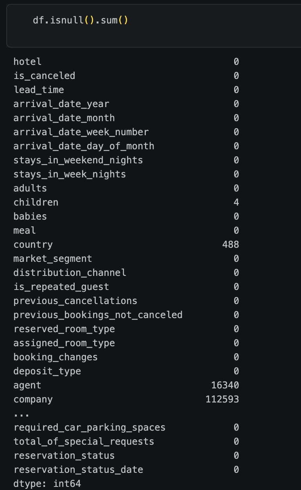

# DOCUMENTACIÓN DEL SISTEMA

FALTA:
- Definición de los roles de la pareja (quién hace qué)
- Justificación del problema
- Análisis exploratorio de datos
- Diseño del sistema
- Resultados y elección final
- Reflexión crítica sobre limitaciones y mejoras

## JUSTIFICACIÓN DEL PROBLEMA 

Las cancelaciones de reservas suponen un problema relevante para el sector hotelero, ya que afectan directamente a la planificación de la ocupación, la gestión de habitaciones, la previsión de ingresos y la organización de recursos.

Poder anticipar qué reservas presentan una mayor probabilidad de cancelación permite a un hotel tomar decisiones más informadas, como ajustar estrategias de overbooking, modificar políticas de cancelación, optimizar campañas comerciales o realizar acciones preventivas sobre determinadas reservas.

El problema se plantea como una tarea de clasificación binaria, donde el objetivo es predecir si una reserva será cancelada (`is_canceled = 1`) o no (`is_canceled = 0`) a partir de las características disponibles en el momento de la reserva.

El uso de técnicas de Machine Learning resulta adecuado porque el dataset contiene múltiples variables relacionadas con el comportamiento de la reserva, como el tiempo de antelación, la duración de la estancia, el tipo de cliente, el segmento de mercado o el historial de cancelaciones. Estas variables pueden presentar relaciones complejas que los modelos pueden aprender para estimar el riesgo de cancelación.

Además, este problema permite comparar distintos enfoques de clasificación, desde modelos clásicos como Logistic Regression, Decision Tree o Random Forest hasta algoritmos como XGBoost y redes neuronales, evaluando cuál ofrece un mejor equilibrio entre precisión y capacidad para detectar correctamente las cancelaciones.

## EJECUCIÓN DEL SISTEMA

### 1. Crear entorno virtual

```bash
uv venv
```

Crea un entorno virtual para aislar las dependencias del proyecto.

### 2. Activar entorno virtual

```bash
source .venv/bin/activate
```

Activa el entorno virtual creado con `uv`.

### 3. Instalar dependencias

```bash
uv pip install -r requirements.txt
```

Instala todas las dependencias necesarias definidas en el archivo `requirements.txt`.

### 4. Ejecutar entrenamiento de modelos

```bash
python src/model_trainer.py
```

Ejecuta el pipeline de entrenamiento, evaluación y selección del mejor modelo.

### 5. Ejecutar predictor

```bash
python src/predictor.py
```

Carga el mejor modelo y realiza predicciones sobre nuevos datos guarados en `data/raw/data_predict.csv`.

### 6. Desactivar entorno virtual

```bash
deactivate
```

Desactiva el entorno virtual y vuelve al entorno habitual del sistema.

## ESTRUCTURA DEL SISTEMA

El proyecto sigue una arquitectura modular en la que `model_trainer.py` actúa como punto principal de entrenamiento y `predictor.py` se utiliza posteriormente para realizar predicciones.

### 1. `model_trainer.py`

Es el script principal del proceso de entrenamiento:

- Crea todos los modelos desde `models.py`.
- Carga datos preprocesados desde `data_loader.py`.
- Entrena cada modelo con los mismos datos. 
- Guarda los modelos entrenados en `models/tests`.
- Evalua cada modelo con el mismo conjunto de test y guarda los resultados en un diccionario.
- Compara los resultados desde `evaluator.py` que devuelve el nombre del mejor modelo.
- Guarda el mejor modelo en `models` bajo el nombre de `best_model`.
- Guarda nombre y tipo del mejor modelo con el nombre de `metadata`.

Se guarda info sobre el mejor modelo ya que no con todos los modelos se actua de la misma manera.

### 2. `predictor.py`

Es el script para hacer predicciones con el mejor modelo. 

**IMPORTANTE:** ejecutar después de ejecutar `model_trainer.py`.

- Carga el mejor modelo desde `models`
- carga datos preprocesados desde `data_loader.py` que somete a los datos de `data/raw/data_predict.csv` al mismo proceso de preprocesado que los datos de entrenamiento.
- Hace predicciones con el mejor modelo.

### 3. `models.py` 

Se encarga de crear todos los modelos.

### 4. `data_loader.py`

Aquí se procesan todos los datos, diferenciando el preprocesamiento para modelos clásicos (preprocesado general) y para redes neuronales.

Una vez realizado el preprocesado general, se guarda el dataset para poder reutilizarlo. 

Para preprocesar los datos para el modelo de red neuronal, se utiliza un preprocesador llamado `preprocessor` que sustituye los valores nulos, escala los valores numéricos y codifica los valores categóricos. Este preprocesador se guarda por si sale la red neuronal como mejor modelo, dado que los datos que se utilicen para la predicción han de pasar por el mismo preprocesador que los datos de entrenamiento.

### 5. `evaluator.py` (TO DO)


## ANÁLSIS EXPLORATORIO DE DATOS (EDA)

Tras hacer el análisis vemos que tenemos datos sobre hoteles y reservas y queremos crear un modelo que pueda predecir qué reservas pueden ser canceladas. El tarjet es la columna `is_canceled`.

El análisis del dataset desembocó en la eliminación de las siguientes columnas:

- `reservation_status` y `reservation_status_code`: contienen información directamente relacionada con el resultado final de la reserva, lo que provocaría *data leakage* al revelar al modelo, de forma directa o indirecta, si la reserva fue cancelada.

- `company`: esta columna contiene un id, para el entrenamiento y predicción mediante modelos de *machine learning* no aporta información relevante. Además como se oberva en la imagen, en el 94% de los casos el valor es nulo.





### MÉTRICA DE SELECCIÓN DEL MEJOR MODELO

El criterio principal utilizado para seleccionar el mejor modelo es el **F1-score de la clase positiva (`is_canceled = 1`)**.

Esta métrica combina precision y recall, permitiendo evaluar tanto la capacidad del modelo para detectar correctamente las cancelaciones como la cantidad de falsos positivos generados. Se considera más adecuada que la accuracy, ya que proporciona una evaluación más equilibrada cuando las clases no tienen exactamente la misma distribución.

Como métricas complementarias se analizan también accuracy, precision, recall y ROC-AUC para obtener una visión más completa del comportamiento de cada modelo.