# DOCUMENTACIÓN DEL SISTEMA

## ROLES DEL GRUPO 

El trabajo se ha divido equitativamente entre los 3 integrantes del grupo, para el reparto hemos decidido que cada uno tocara un poco de todo. Por tanto, todos hemos trasteado y creado algún modelo, todos hemos trabajado con el dataset para decidir como hacerlo lo más óptimo posible. 


## JUSTIFICACIÓN DEL PROBLEMA 

Las cancelaciones de reservas suponen un problema relevante para el sector hotelero, ya que afectan directamente a la planificación de la ocupación, la gestión de habitaciones, la previsión de ingresos y la organización de recursos.

Poder anticipar qué reservas presentan una mayor probabilidad de cancelación permite a un hotel tomar decisiones más informadas, como ajustar estrategias de overbooking, modificar políticas de cancelación, optimizar campañas comerciales o realizar acciones preventivas sobre determinadas reservas.

El problema se plantea como una tarea de clasificación binaria, donde el objetivo es predecir si una reserva será cancelada (`is_canceled = 1`) o no (`is_canceled = 0`) a partir de las características disponibles en el momento de la reserva.

El uso de técnicas de Machine Learning resulta adecuado porque el dataset contiene múltiples variables relacionadas con el comportamiento de la reserva, como el tiempo de antelación, la duración de la estancia, el tipo de cliente, el segmento de mercado o el historial de cancelaciones. Estas variables pueden presentar relaciones complejas que los modelos pueden aprender para estimar el riesgo de cancelación.

Además, este problema permite comparar distintos enfoques de clasificación, desde modelos clásicos como Logistic Regression, Decision Tree o Random Forest hasta algoritmos como XGBoost y redes neuronales, evaluando cuál ofrece un mejor equilibrio entre precisión y capacidad para detectar correctamente las cancelaciones.

## EJECUCIÓN DEL SISTEMA

### 1. Crear entorno virtual

```bash
uv venv
```

Crea un entorno virtual para aislar las dependencias del proyecto.

### 2. Activar entorno virtual

```bash
source .venv/bin/activate
```

Activa el entorno virtual creado con `uv`.

### 3. Instalar dependencias

```bash
uv pip install -r requirements.txt
```

Instala todas las dependencias necesarias definidas en el archivo `requirements.txt`.

### 4. Ejecutar entrenamiento de modelos

```bash
python src/model_trainer.py
```

Ejecuta el pipeline de entrenamiento, evaluación y selección del mejor modelo.

### 5. Ejecutar predictor

```bash
python src/predictor.py
```

Carga el mejor modelo y realiza predicciones sobre nuevos datos guarados en `data/raw/data_predict.csv`.

### 6. Desactivar entorno virtual

```bash
deactivate
```

Desactiva el entorno virtual y vuelve al entorno habitual del sistema.

## ESTRUCTURA DEL SISTEMA

El proyecto sigue una arquitectura modular en la que `model_trainer.py` actúa como punto principal de entrenamiento y `predictor.py` se utiliza posteriormente para realizar predicciones.

### 1. `model_trainer.py`

Es el script principal del proceso de entrenamiento:

- Crea todos los modelos desde `models.py`.
- Carga datos preprocesados desde `data_loader.py`.
- Entrena cada modelo con los mismos datos. 
- Guarda los modelos entrenados en `models/tests`.
- Evalúa cada modelo con las funciones comunes de `evaluator.py` y guarda los
  resultados en un diccionario.
- Mantiene una selección provisional por F1 pendiente de integrar con la
  selección configurable y los resultados definitivos de todos los modelos.
- Guarda el mejor modelo en `models` bajo el nombre de `best_model`.
- Guarda nombre y tipo del mejor modelo con el nombre de `metadata`.

Se guarda info sobre el mejor modelo ya que no con todos los modelos se actua de la misma manera.

### 2. `predictor.py`

Es el script para hacer predicciones con el mejor modelo. 

**IMPORTANTE:** ejecutar después de ejecutar `model_trainer.py`.

- Carga el mejor modelo desde `models`
- carga datos preprocesados desde `data_loader.py` que somete a los datos de `data/raw/data_predict.csv` al mismo proceso de preprocesado que los datos de entrenamiento.
- Hace predicciones con el mejor modelo.

### 3. `models.py` 

Se encarga de crear todos los modelos.

### 4. `data_loader.py`

Aquí se procesan todos los datos, diferenciando el preprocesamiento para modelos clásicos (preprocesado general) y para redes neuronales.

Una vez realizado el preprocesado general, se guarda el dataset para poder reutilizarlo. 

Para preprocesar los datos para el modelo de red neuronal, se utiliza un preprocesador llamado `preprocessor` que sustituye los valores nulos, escala los valores numéricos y codifica los valores categóricos. Este preprocesador se guarda por si sale la red neuronal como mejor modelo, dado que los datos que se utilicen para la predicción han de pasar por el mismo preprocesador que los datos de entrenamiento.

### 5. `evaluator.py`

Calcula las métricas comunes de clasificación binaria, genera matrices de
confusión y curvas ROC, construye la comparación entre modelos y permite
seleccionar el mejor modelo mediante una métrica configurable.

### 6. `feature_importance.py`

Asocia las importancias de un modelo de árboles con los nombres de las
variables transformadas y permite crear una tabla ordenada y una gráfica con
las variables más importantes.

La explicación detallada de Random Forest, XGBoost, la comparación común y
feature importance está disponible en
[Documentación de modelos ensemble](docs/ensemble_models.md).

### 7. `output_manager.py`

Encargado de guardar los gráficos, tablas, matrices de confusión.

## ANÁLSIS EXPLORATORIO DE DATOS (EDA)

Tras hacer el análisis vemos que tenemos datos sobre hoteles y reservas y queremos crear un modelo que pueda predecir qué reservas pueden ser canceladas. El tarjet es la columna `is_canceled`.

El análisis del dataset desembocó en la eliminación de las siguientes columnas:

- `reservation_status` y `reservation_status_code`: contienen información directamente relacionada con el resultado final de la reserva, lo que provocaría *data leakage* al revelar al modelo, de forma directa o indirecta, si la reserva fue cancelada.

- `company`: esta columna contiene un id, para el entrenamiento y predicción mediante modelos de *machine learning* no aporta información relevante. Además como se oberva en la imagen, en el 94% de los casos el valor es nulo.


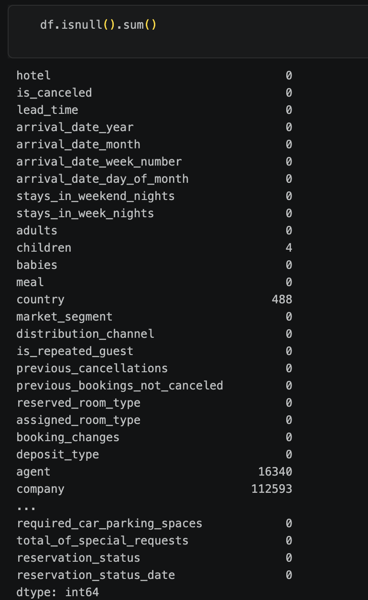


Tras eliminar las columnas mencionadas, pasamos al siguiente paso que es el preprocesamiento de los datos para que los modelos trabajen mejor según el caso. 

Agrupamos el preprocesamiento en dos grupos:

1. *tree_preprocessor:* preprocesador que imputa valores numéricos y categóricos y codifica los valores categóricos para los modelos:
    - DecissionTreeClassifier
    - RandomForestClassifier
    - XGBClassifier

2. *scaled_preprocessor:* preprocesador hace lo mismo que el anterior pero añade el escalado de los valores numéricos, utilizado para modelos:
    - LogisticRegression
    - Neural network

Aplicamos escalado en estos porque son sensibles a la magnitud de las variables y entrenan mejor cuando están en escalas similares, mientras que los modelos que utilizan *tree_preprocessor* dividen los datos por umbrales y no dependen de la escala de las características.

Para escalar los valores numéricos se utiliza el método de *StandardScaler* porque normaliza las variables numéricas para que estén en escalas comparables. 

En el caso de la codificación se utilza *OneHotEncoder* porque transforma las variables categóricas en columnas numéricas sin introducir un orden artificial entre sus categorías.

## MÉTRICA DE SELECCIÓN DEL MEJOR MODELO

El flujo actual de `model_trainer.py` utiliza provisionalmente el **F1-score de
la clase positiva (`is_canceled = 1`)**. La utilidad de selección implementada
permite configurar `accuracy`, `precision`, `recall`, `f1` o `roc_auc`.

Esta métrica combina precision y recall, permitiendo evaluar tanto la capacidad del modelo para detectar correctamente las cancelaciones como la cantidad de falsos positivos generados. Se considera más adecuada que la accuracy, ya que proporciona una evaluación más equilibrada cuando las clases no tienen exactamente la misma distribución.

Como métricas complementarias se analizan también accuracy, precision, recall y ROC-AUC para obtener una visión más completa del comportamiento de cada modelo.

La métrica principal y el modelo ganador solo se considerarán definitivos
cuando estén disponibles todos los modelos, el preprocesamiento común y sus
resultados sobre el mismo conjunto de test.

## RESULTADOS OBTENIDOS

Tras entrenar y evaluar los cinco modelos, se obtuvieron los siguientes resultados:

| Modelo | Accuracy | Precision | Recall | F1-score | ROC-AUC |
|---|---:|---:|---:|---:|---:|
| Logistic Regression | 0.819 | 0.813 | 0.665 | 0.731 | 0.896 |
| Decision Tree | 0.865 | 0.823 | 0.811 | 0.817 | 0.910 |
| Random Forest | 0.894 | 0.896 | 0.809 | 0.850 | 0.958 |
| XGBoost | 0.870 | 0.864 | 0.769 | 0.814 | 0.945 |
| Neural Network | 0.862 | 0.808 | 0.823 | 0.815 | 0.939 |

En términos generales, todos los modelos presentan un rendimiento satisfactorio, aunque existen diferencias relevantes entre ellos. **Random Forest obtiene los mejores resultados globales**, con el mayor `Accuracy`, `Precision`, `F1-score` y `ROC-AUC`, alcanzando un F1 de aproximadamente **0.85** y un ROC-AUC de **0.958**.

La **red neuronal** presenta el mayor `Recall` de todos los modelos, con un valor cercano a **0.823**, lo que indica una buena capacidad para detectar reservas que finalmente se cancelan. Por su parte, **Logistic Regression** es el modelo con menor rendimiento, especialmente en `Recall` y `F1-score`.

De acuerdo con el criterio definido para el proyecto, basado principalmente en el **F1-score**, el modelo seleccionado finalmente es **Random Forest**.

### Comparación de curvas ROC

La siguiente gráfica permite comparar directamente la capacidad de discriminación de todos los modelos:

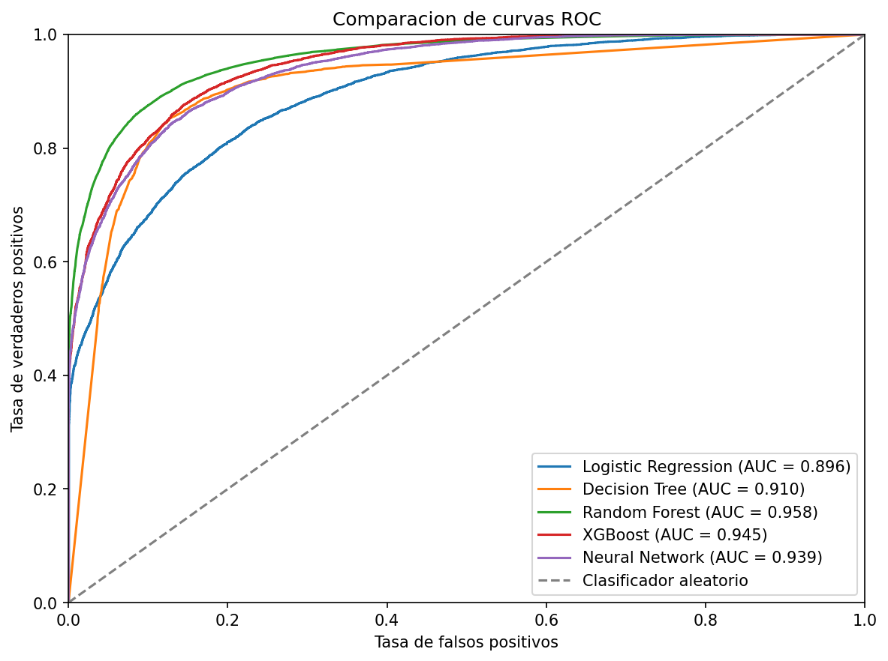

### Matrices de confusión

Las matrices de confusión permiten observar los aciertos y errores de clasificación de cada modelo.

#### Logistic Regression

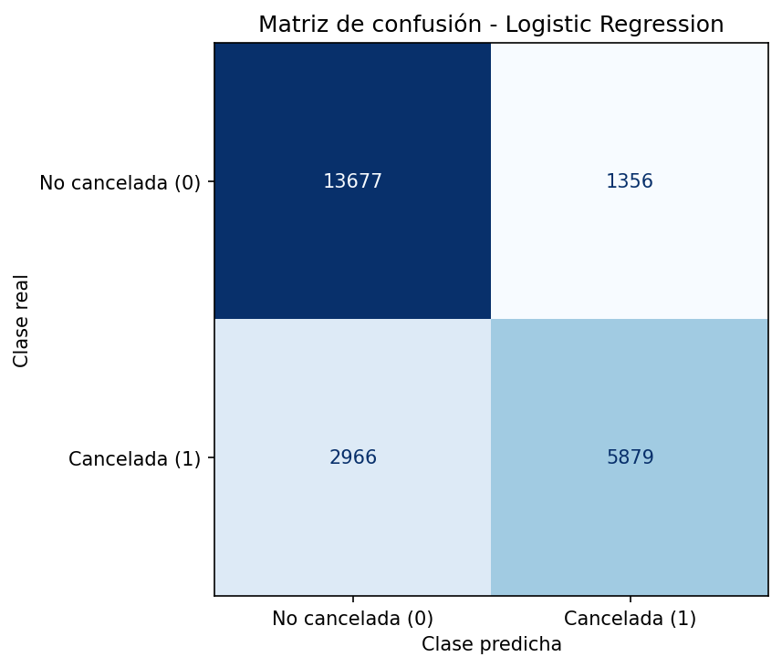

#### Decision Tree

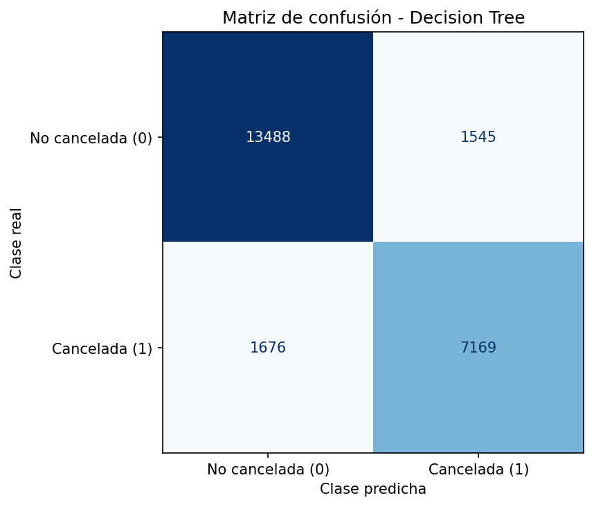

#### Random Forest


#### XGBoost

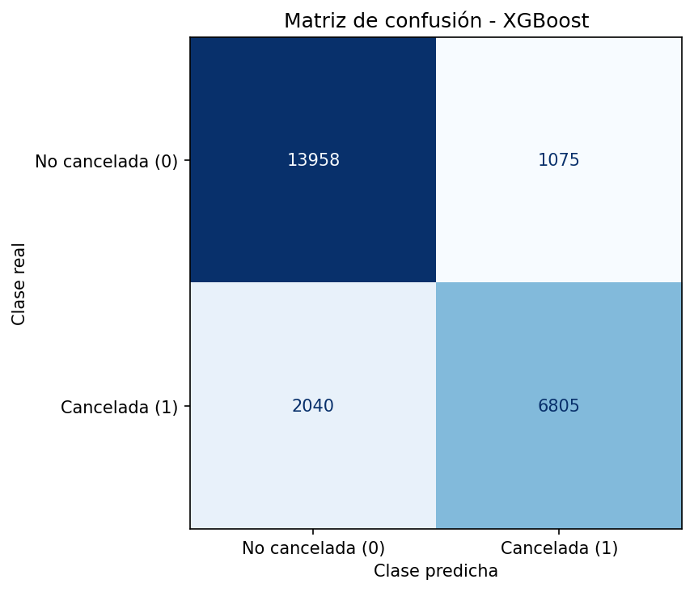

#### Neural Network

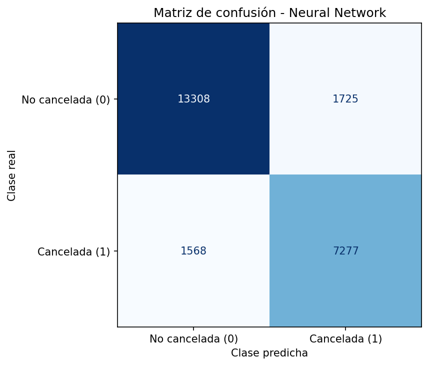

### Curvas ROC individuales

#### Logistic Regression

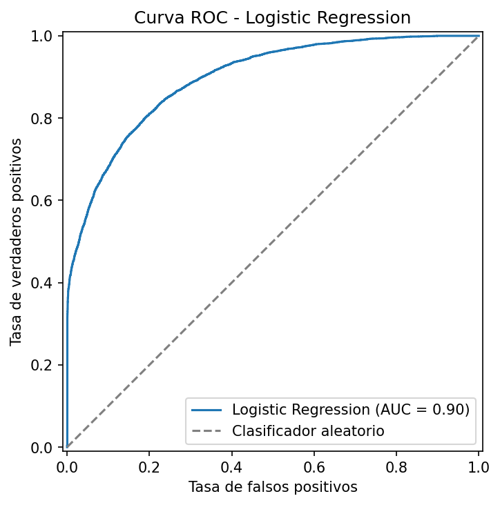

#### Decision Tree

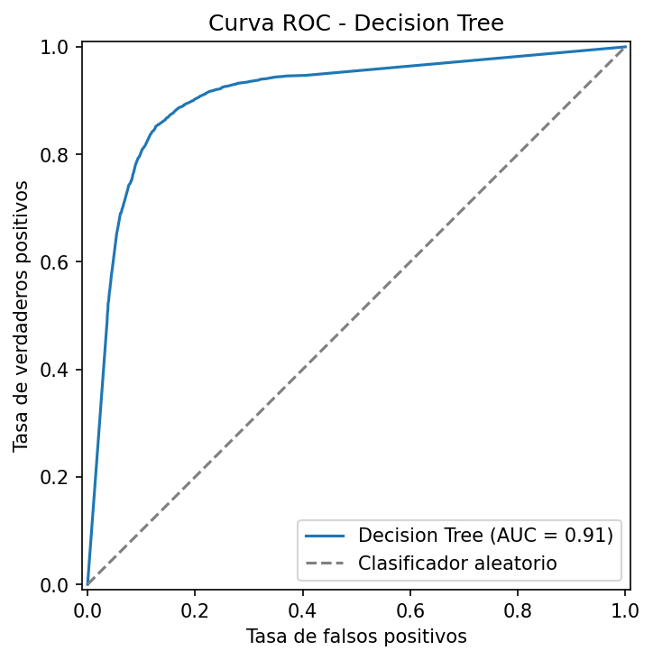

#### Random Forest

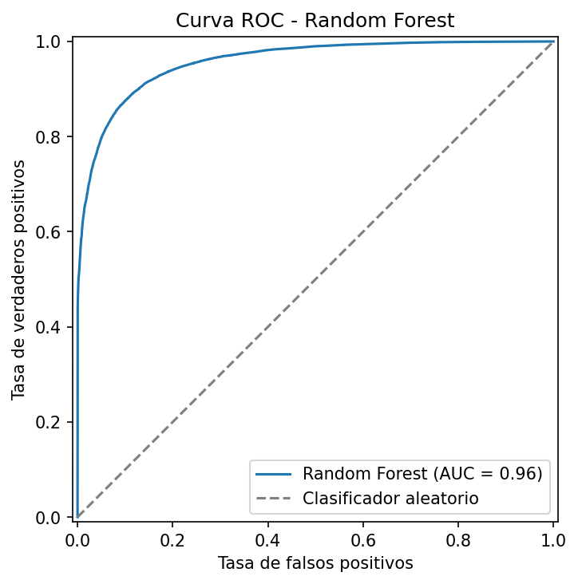

#### XGBoost

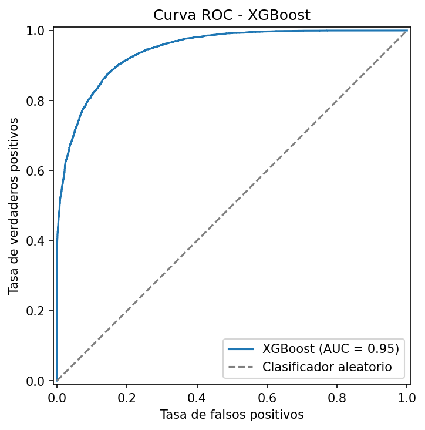

#### Neural Network

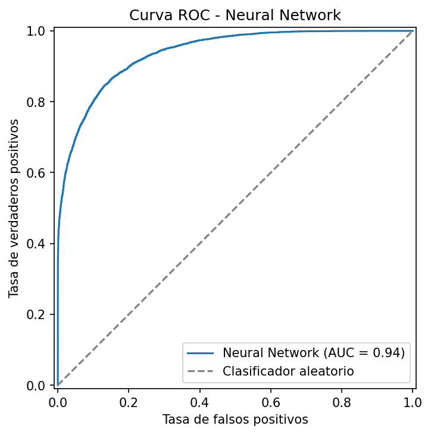

### Importancia de características

Para los modelos que permiten analizar la importancia de las variables, se han generado las siguientes gráficas.

#### Random Forest

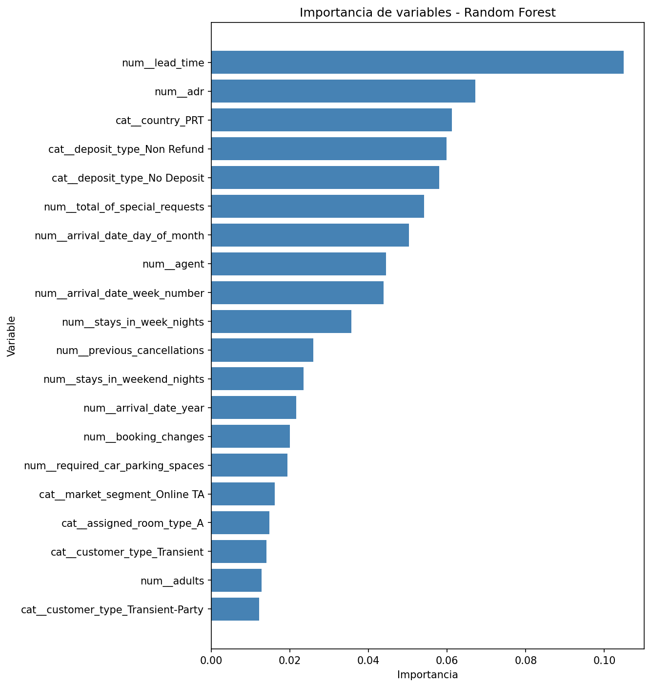

En Random Forest, algunas de las variables con mayor influencia son `lead_time`, `adr`, el país de origen, el tipo de depósito y el número de peticiones especiales.

#### XGBoost

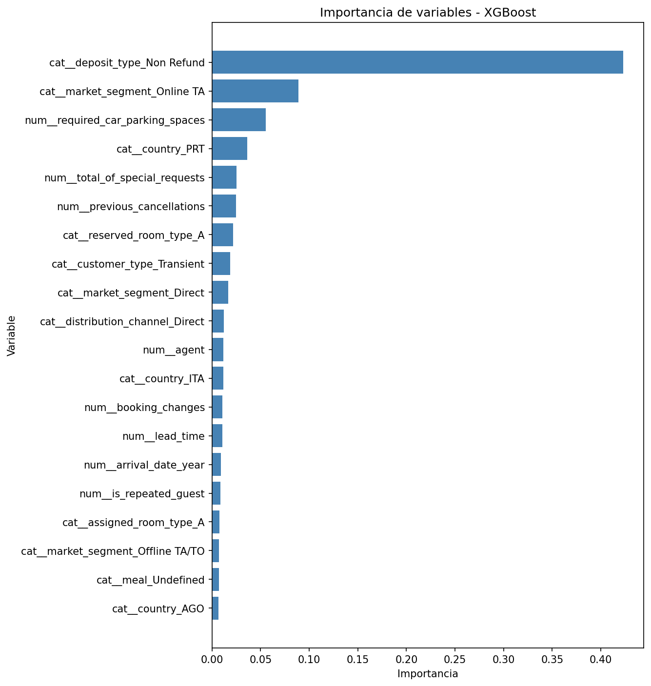

En XGBoost destaca especialmente la variable relacionada con los depósitos no reembolsables (`deposit_type_Non Refund`), seguida del segmento de mercado, las plazas de aparcamiento solicitadas y el país de origen.

### Resultados de predicción

Una vez seleccionado y cargado el mejor modelo, `predictor.py` realiza predicciones sobre nuevas reservas y muestra el resultado por consola.

En el ejemplo mostrado se procesaron 5 reservas con datos inventados, de las cuales **4 fueron clasificadas como no canceladas** y **1 como cancelada**. Este resultado demuestra el funcionamiento completo del pipeline de inferencia, desde la carga de los nuevos datos hasta la obtención de la predicción final.

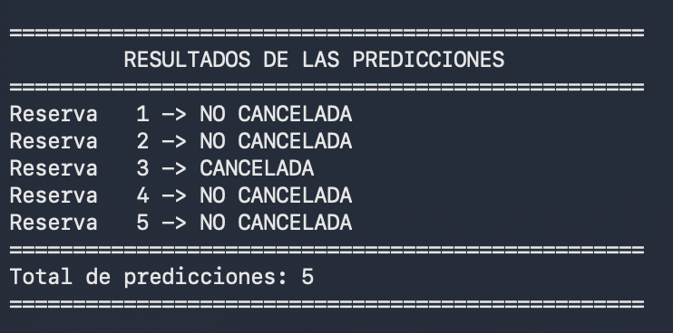

## LIMITACIONES Y POSIBLES MEJORAS

Como principales limitaciones, el proyecto depende de la calidad y representatividad del dataset utilizado, por lo que el rendimiento obtenido puede no trasladarse directamente a reservas reales de otros hoteles o periodos distintos. 

Como mejoras futuras, el sistema podría integrarse en una API o aplicación web, automatizar el reentrenamiento con nuevos datos, añadir herramientas de interpretabilidad como SHAP, que ayuda a entender porque un modelo ha tomar una decisión determinada, y establecer un proceso de monitorización para detectar pérdida de rendimiento del modelo con el tiempo. También podría mejorarse la evaluación del modelo probándolo sobre distintas particiones de los datos, analizando cómo cambia el comportamiento de las reservas con el tiempo y teniendo en cuenta el coste económico de los distintos tipos de error.
